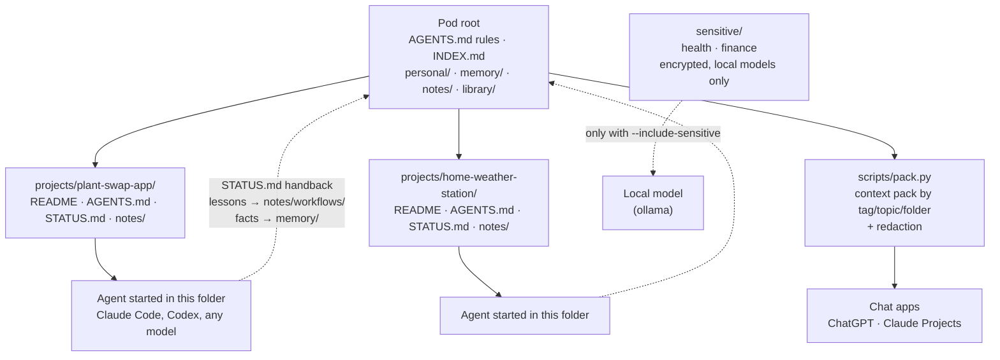

# Context Pod

**A folder of plain-text files about your life and work that you own, and can plug into any AI model.**

Every new chat with an assistant starts from zero. You spend the first twenty minutes re-explaining
who you are, what you're working on and how you like to be talked to, and when the conversation
runs out of room, it's all gone again. A context pod fixes that. It's a folder of markdown files,
your context written down once, that you hand to whichever model you're using today.

- **Portable.** Plain text outlives every app. It opens on any computer, in any editor, in 30 years.
- **Owned.** It lives on your disk, not in a company's memory feature. No account, no export button, no lock-in.
- **Model-agnostic.** Claude, ChatGPT, Codex, a local model on your laptop: they all read markdown.
- **Offline and uncommercial.** No service to shut down, no one selling it to advertisers.
- **Private by layers.** The open question with a pod is privacy. This repo's answer: split the pod into
  public, private and sensitive layers, encrypt the sensitive one, and only ever send it to a model
  running on your own machine. See [docs/privacy.md](docs/privacy.md).

## How it fits together

A pod is also your **workspace**: the root folder your AI agents work inside. Root rules apply
everywhere, each project gets its own folder with its own brief, and agents write their progress
back into the pod.



## Quick start

**1. Copy the template** somewhere private (not inside this repo), and make it a git repo so
every agent finds the root rules:

```sh
cp -R template ~/pod && cd ~/pod && git init
```

**2. Fill in the basics.** Replace Alex (the fictional example person) with you. Short and true
beats long and polished.

| File | What goes in it |
|---|---|
| `AGENTS.md` | The rules every agent follows in your pod: what lives where, what needs your OK |
| `personal/about-me.md` | Who you are in five lines, then the background an assistant should know |
| `personal/goals.md` | What you're working towards this year and this quarter, with dates |
| `personal/preferences.md` | How you like to work and be talked to |
| `memory/` | A few one-fact memories (the format is explained below) |

Then `personal/people.md`, `personal/ideas.md` and `personal/journal/` when you're ready. Leave `sensitive/` until
you've read [docs/privacy.md](docs/privacy.md).

**3. Start a project and work inside it:**

```sh
cp -R projects/_template projects/my-project    # fill in README.md and AGENTS.md
cd projects/my-project && claude                  # or codex, or any agent
```

The agent reads the project's brief plus the root rules, works only in that folder, and leaves a
handback note in `STATUS.md`. The full routine is in [docs/workflow.md](docs/workflow.md).

**4. Keep it tidy** (from this repo, pointing at your pod):

```sh
python3 scripts/index.py ~/pod   # regenerates INDEX.md and memory/MEMORY.md
python3 scripts/lint.py  ~/pod   # frontmatter, broken [[links]], oversized files, stray secrets
```

**5. Plug it into a chat app or local model** with a pack:

```sh
python3 scripts/pack.py ~/pod --tag plant-swap --redact -o packs/plant-swap.md
```

[docs/plugging-in.md](docs/plugging-in.md) covers Claude Code, OpenAI Codex, ChatGPT and Claude
Projects, and local models through ollama.

## The memory format

`memory/` holds small, durable facts, one per file, with an index the model reads first.

```
memory/
  MEMORY.md                    # - [Works late, slow mornings](user-night-owl.md) — focused hours are 21:00 to 01:00
  user-night-owl.md
  feedback-no-bullet-walls.md
  project-plant-swap-demo.md
```

```markdown
---
name: No walls of bullets
description: Prose answers that lead with the point; bullets only for steps or checklists
metadata:
  type: feedback          # user | feedback | project | reference
  tags: [communication, writing]
  updated: 2026-03-02
---

Answer in short paragraphs that lead with the conclusion.

**Why:** the reason, so a model can handle edge cases instead of following a rule blindly.

**How to apply:** what to actually do differently.

Related: [[user-night-owl]]
```

The index stays small, so a model can always load it. The detail lives in files it opens only when relevant.
More in [docs/writing-good-context.md](docs/writing-good-context.md).

## What's in this repo

```
template/            a ready-to-copy pod workspace (fictional example person: Alex)
  AGENTS.md          root rules every agent reads first (CLAUDE.md imports it)
  personal/  projects/  library/  notes/  study/  system/  memory/  sensitive/
docs/
  workflow.md        how I work with a pod: projects, agents, handbacks
  writing-good-context.md
  plugging-in.md
  privacy.md
scripts/             Python 3, standard library only
  pack.py            build one context pack for a topic/tag, with redaction
  index.py           regenerate INDEX.md and memory/MEMORY.md from frontmatter
  lint.py            check frontmatter, links, file sizes, stray secrets
tests/               python3 -m unittest discover -s tests
```

No dependencies. Python 3.9 or newer.

## Background

The idea, and why it matters: [Why I'm Building a Context Pod](https://jetworks.io/posts/context-pods/).

## License

MIT. See [LICENSE](LICENSE).

---

Made by Jet Williams · jetworks: https://jetworks.io
