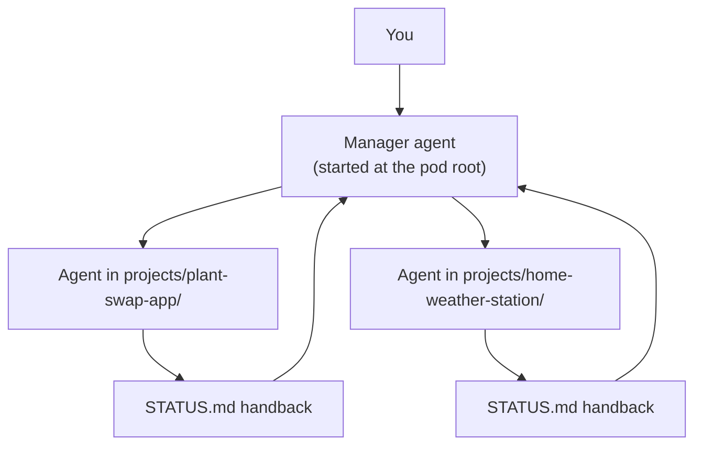

# How I work with a pod

A pod isn't only a folder of "about me" files that you paste into a chat. Used fully, it's the
**root workspace** where your agents do their work, and the **source of truth** they read from
and write back to. This page is the day-to-day routine.

## The layout

```
pod/
  AGENTS.md        rules every agent reads first (CLAUDE.md imports it)
  INDEX.md         what's where
  personal/        about-me, goals, preferences, people, ideas, journal/
  projects/
    _template/     copy this to start a project
    plant-swap-app/
      README.md    what and why
      AGENTS.md    the brief + rules for the agent working here (CLAUDE.md imports it)
      STATUS.md    current state, next steps, the last handback note
      notes/
  library/         brand/, refs/, templates/: reusable assets
  notes/           research/, briefs/, workflows/ (lessons across projects)
  study/           learning tracks
  system/          machine scripts: backups, start/stop
  memory/          MEMORY.md + one fact per file
  sensitive/       health, finance: encrypted, local models only
```

## 1. The pod is the source of truth

If it matters, it's written in the pod. Not in a chat history, not in a tool's built-in memory,
not in your head. Chats end and tools change; the folder stays. When an agent learns something
worth keeping, the last step of the job is writing it into the right file.

When a file and a conversation disagree, the conversation wins for that session, and the file
gets updated before the session ends.

## 2. A new project is a new folder

```sh
cd ~/pod
cp -R projects/_template projects/home-weather-station
```

1. **Fill in `README.md`**: what it is, why it matters (which goal it serves), decisions so far.
2. **Fill in `AGENTS.md`**: the brief for the agent: what it's there to do, the next deadline,
   the fixed choices (stack, tools, style), what needs your OK, what it must never do.
3. **`cd` into the folder and start your agent there:**

   ```sh
   cd ~/pod/projects/home-weather-station
   claude        # or: codex, or any agent that reads AGENTS.md / CLAUDE.md
   ```

   Started there, the agent reads the project's `AGENTS.md` (or `CLAUDE.md`) **and** the root
   rules above it, so it knows both the house rules and this project's brief without you
   re-explaining anything.
4. **It works only in that folder.** It may read the rest of the pod (your preferences, the
   library, lessons in `notes/workflows/`) but edits only its own project.
5. **It finishes by updating `STATUS.md`**: current state, next steps, and a dated handback note
   (what it did, what's unfinished, what you need to decide). The next session, with the same
   model or a different one, starts by reading that note.

## 3. One agent per project, one manager at the root

Run one agent session per project, each started in its own folder. They don't step on each
other's files, and each one's context stays focused on one job.

If you juggle several projects, run one more agent at the root of the pod as a **manager**. It
doesn't do project work. It reads each project's `STATUS.md`, tells you what's waiting on you,
routes your requests to the right project session, and keeps the root files (`INDEX.md`,
`memory/`, `notes/workflows/`) tidy. The sibling repo **rc-studio** shows how to run that
manager from your phone.



## 4. Lessons go to notes/workflows/, facts go to memory/

Two kinds of things get learned along the way. Keep them apart:

| It's about... | Example | Goes in |
|---|---|---|
| **How to do the work**, across projects | "Let agents experiment on a copy of the database, never the real one" | `notes/workflows/<lesson>.md` |
| **You** | "Focused hours are 21:00 to 01:00" | `memory/<fact>.md`, then `scripts/index.py` |
| **This project only** | "Photos are stored on disk, path in SQLite" | the project's `README.md` (decisions) or `notes/` |

Root `AGENTS.md` tells every agent to check `notes/workflows/` before starting, so a lesson
learned in one project protects all the others.

## 5. Switching models

The same folder works with any agent, which is the point:

- **Claude Code** reads `CLAUDE.md` in the folder it starts in and in the folders above it. Each
  `CLAUDE.md` in the template is a pointer that imports `AGENTS.md` (`@AGENTS.md`), so the rules
  live in one place.
- **OpenAI Codex** reads `AGENTS.md` files from the top of the repository down to the folder it
  starts in. Make the pod a git repository (`git init` at the root) so the root rules are picked up.
- **Other agents and chat apps**: point them at `AGENTS.md`, or build a pack
  (`scripts/pack.py --folders projects/plant-swap-app personal/preferences.md`).

Because every project's state lives in `STATUS.md` and not in a chat, you can stop a session in
one tool on Monday and pick it up in another on Tuesday. See [plugging-in.md](plugging-in.md) for
per-tool details.

## A week, in practice

- **Start of a session:** `cd` into the project, start the agent, say what you want today. It reads
  the brief and the last handback by itself.
- **End of a session:** the agent updates `STATUS.md`; anything lasting goes to `memory/` or
  `notes/workflows/`.
- **Once a week:** run `scripts/index.py` and `scripts/lint.py`, skim every `STATUS.md` (or ask the
  manager to), archive finished projects to `projects/archive/`.
- **Once a month:** prune `memory/` of things that are no longer true, and run a backup restore test.
